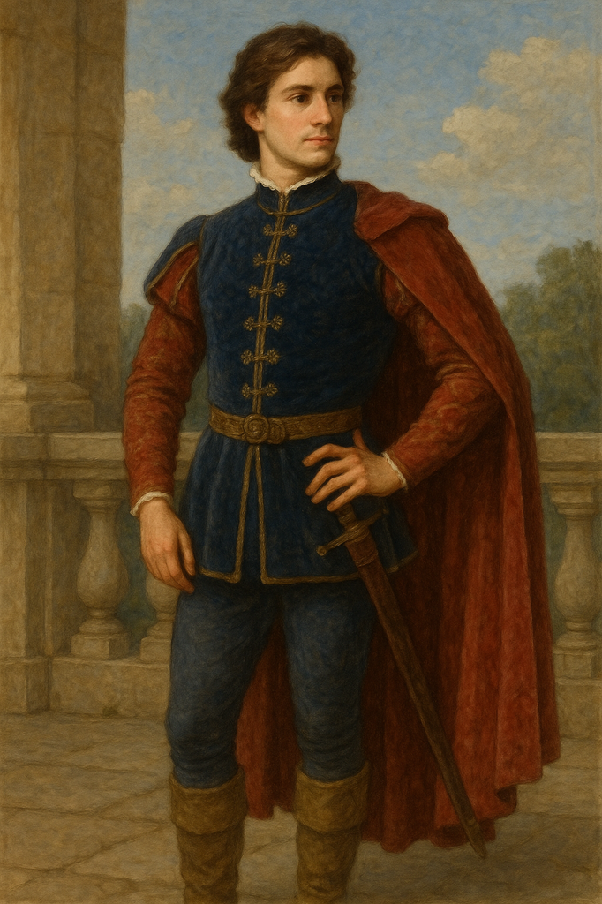

# Fairy tales to use with our agents

## Text of stories is taken from [World of Tales](https://www.worldoftales.com/fairy_tales.html).

## Prompts:
- Please identify the distinct characters in the attached story and identify their key characteristics, including the setting in which they typically may be found.
- Please create an image of (Character Name)
- Please create an image which shows the events from the first paragraph of the attached story.
- Until I ask you to go back to normal, please converse with me as if you are (Character Name) from the attached story.
- How did you feel when (event from story) happened?

## Sample prompts for *Cinderella*: (Both ChatGPT and Grok responded realistically in character via their web interfaces.)
- Related to Cinderella's father:
    - Until I ask you to go back to normal, please converse with me as if you are Cinderella's father from the attached story.
    - How did you feel when Cinderella was treated so badly by her step sisters?
    - Why did you decide to remarry after Cinderalla's mother died?
- Related to the Prince:
    - Now please converse with me as if you are the Prince from the attached story.
    - Why did you choose Cinderella when you could have wed any maiden in the kingdom?
    - Were you enamored with another before you met Cinderella?
    - If you had never met Cinderella or another for whom you felt true love, would you have married another out of duty to the kingdom?
    - What would you have done if you met Cinderella after already marrying another out of duty rather than love?
- Can we get agents representing different characters to converse with one another?  Grok did a good job generating a conversation between Cinderella and the prince from the below prompt, but that was Grok playing both sides of the conversation rather representing only one side in communication with another agent that could be powered by another model.
    - Now please enact a brief debate from Cinderella and the Prince from the attached story about whether the will live in palace or the countryside after their wedding.

## Image prompts and images for *Cinderella* from ChatGPT:
- Please create an image of Cinderella.

- Please create an image of the Prince.

- Please create an image which shows the events from the first paragraph of the attached story.

